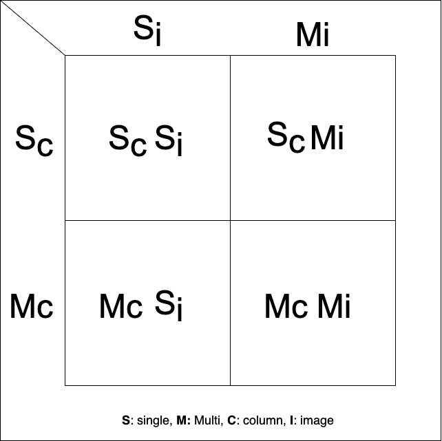

<p align="center">
</p>
<h3 align="center">Laraimage</h3>
<p align="center">A Laravel package that adds a simple image functionality to any Laravel model</p>
<br>

---

## Documentation

Check out the full documentation at [Laraimage](https://laraimage.husseinferas.com/)

## Installation

Install Laraimage using [composer](https://getcomposer.org/).


```
composer require husseinferas/laraimage
```


## Getting started

Laraimage served four use cases when using images in web applications and backend services:
* Single Column Single Image
* Single Column Multi Image
* Multi Column Single Image
* Multi Column Multi Image

which appearing in this diagram:   



---

## Contributing

* **Logo:** designed by [Yasir Nabeel](https://github.com/YasirNabeel), Inspired by [L5Modular](https://github.com/Artem-Schander/L5Modular) logo.
* **Documentation:** Inspired by [Artem Schander](https://github.com/Artem-Schander).
* **Testing:** Inspired by [Jaanus Vapper](https://github.com/hulkur).

Pull requests are welcome. For major changes.

## License

Laraimage is licensed under the terms of the [MIT License](https://github.com/husseinferas/laraimage/blob/master/LICENSE)
(See LICENSE file for details).
